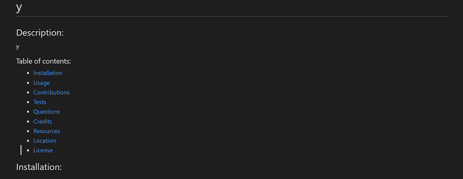

[](https://www.javascript.com)<br>
# ****README.md** Generator using Node.js with _inquirer_**


### Welcome to my markdown file generator. Where one can quickly and easily create a README file by using the command line. This application interface, dependant upon user input, will create ***Professional*** README documentation. In turn, it allows a developer more time to working on a project.<br><br>

### **Table of contents:**

- [Getting Started](#getting)
- [Installations](#installations)
- [Usage](#usage)
- [Contributions](#contributions)
- [Tests](#tests)
- [Questions](#questions)
- [Credits](#credits)
- [Resources](#resources)
- [Location](#location)
- [License](#license)

## Getting Started:
<br>First to get started you will need to have downloaded Node.js.  If you haven't, you may go here.&nbsp;&nbsp;[*Node.js downloads*](https://nodejs.org/en/download/)

## Installations:
<br>inquirer&nbsp;&nbsp;[*for more information*](https://www.npmjs.com/package/inquirer)


*For example 1:*&nbsp;&nbsp;First, travel to the directory folder containing the index.js file and open in VSCode.  Second, right click on the index.js file, select 'Open in Integrated Terminal'.  Third, once the terminal opens, on the command line type the first provided code example *below*.<br><br>*For example 2:*&nbsp;&nbsp;On the command line type the second provided code example *below*.  Now you'll noticed a folder name node_modules has appeared.  These are the packets needed to run inquirer.

*Example 1:*
```shell
npm init -y
```

*Example 2:*
```shell
npm i inquirer@8.2.4
```

## Usage:
Once the above installations are complete, to initalize application, on the command line type: node.js index.js.  You'll be guided through a series of prompts that will generate a README file containing most sections you would like to add to your file.  At the beginning there is also a helpful hint to remind you the language syntax a markdown file uses and how it can be useful to use with your input.



## Contributions:
You may fork for personal use only at this time.

## Tests:
First test, for adding multiple files, ask one message repeated until condition met while changing message output slightly. example: add file 1. add file 2. add file 3.  May be possible with a while loop in filter or use reactive interface or both.  Second test, find a way to ask for input and seperate that input to be inserted into certain locations.  example: enter person's name and profile link.  [person's name](profile link).  Possible again with a while loop or filter with input parameters or again reactive interface.

## Questions:

For any questions or additional feedback.

**_Contact Information:_**

Email:&nbsp;&nbsp;[zMag33z](mag33.cdh@gmail.com)


  ## Credits:
  
  **_Project Creators:_**

  A quick shout out to those who helped bring this project together.

  Just showing appearance of subsection creators.
  

**_Contributors:_**

Would also like to thank all contributors at this time.&nbsp;&nbsp;All of the input is and was greatly appreciated and this project would not be as far as it is without it.

&nbsp;&nbsp;Again.  Thank you.

Just showing appearance of subsection contributors.

## Resources:
[node.js](https://nodejs.org/en/docs/)<br>[inquirer](https://www.npmjs.com/package/inquirer?activeTab=readme)<br>[Google](https://www.google.com)<br>

## Location:
[**README.md** Generator using Node.js with _inquirer_](https://github.com/zMag33z/week-9-READme_Generator)


## License:


See *Terms & Conditions* of the license [**_HERE_**.](https://zmag33z.github.io/week-9-READme_Generator/LICENSE.md)

### [Back to top](#)